# Garden Planner API

## R1 - Problem Identification

A few years ago, I started planning and establishing my first garden in the beautiful Southern Highlands of New South Wales, Australia. As enjoyable and rewarding as the experience was, I was quickly overwhelmed by how I was possibly going to manage it in the long term. I set up repeating monthly, quarterly and even yearly reminders across multiple applications, wrote notes and even resorted to putting all the plant slips in a zip lock bag! Fast forward a few months or even years and I never felt like I was in control, knowing what plants needed what and when. This organisational problem was only exacerbated as new plants were added and older plants removed.

The Garden Planner API was built using Flask to solve the problem of a person not being able to keep track of all of their trees and/or plants. It aims to be a central repository for a user to log details about the plants and trees they have in their outdoor and indoor spaces. It abides by full CRUD functionality by enabling the user to:

- Create new entries/records for the plants or trees they obtain with attributes for name, the plant's preferred location, the watering and fertilisation rates, as well as a space for additional comments.
- Create areas where plants/trees belong, as well as spaces within those areas. For example, a user's "Backyard" area might contain multiple spaces or gardens.
- Access entries they have entered in order to be reminded about a plant's upkeep.
- Update plant records at any point.
- Delete plant records at any point.

This CRUD functionality helps the user to stay organised and in control of their garden planning and maintenance.

## R2 - Problem Justification

There are a number of reasons why the Garden Planner application was built and has a genuine need:

- The Garden Planner API simplifies and unifies the process of plant and tree record keeping. For me personally, I was finding it overwhelming managing how to log when I had last watered, fertilised, transplanted or repotted my plants and I was finding that I was "solving" this problem by logging reminders in different applications, keeping tab of the plant information slips coming back with the plant from a nursery, or simply just having to look and see what the plant was requiring at any given moment. This method of garden management was cumbersome and it was difficult to maintain accuracy and a method of record-keeping. The simple process of entering data in fields such as plants and planting spaces allows for the user to keep tab of their plant varieties in a single, organised location.
- The application does not prefill the data entry fields with irrelevant information about plant upkeep from other countries with different climates to Australia. The user can enter accurate and relevant information, often obtained by simply looking over the slip that comes with each plant.
- The user can tailor the application to their needs, making it as simple or detailed as they need. It's designed to be flexible, allowing the user to input data that reflects their space. This solves the problem identified in R1 above by giving the user an opportunity to record all their plant species and planting locations in an organised manner.
- As our gardens change and update, the Garden Planner API allows for full CRUD functionality across the various entities. This solves the problem of not being able to easily remember how to care for our gardens as they grow.

## R3 - Evaluation of Relational Databases and PostgreSQL

### Relational Databases

According to IBM, database management systems (DBMS) are categorised according to their data structures or types, with common examples being:

- inverted list,
- hierarchic,
- network, and
- relational (/What is a database management system?/).

Using a DBMS for the Garden Planner API has allowed for a full suite of data manipulation tools (DML) as well as tools for management of the database structure itself (DDL). There are many distinct advantages to DBMS, in general, including:

- easier data handling,
- security and privacy,
- a reduction in data inconsistency and redundancy,
- ease of use, and
- abstraction (/Advantages of Database Management System/).

However, DBMS do differ and each system has advantages and disadvantages. A hierarchical model, for example, would be well suited to data that stays relatively static. However, this Garden Planner API requires a dynamism in its data structures as well as its data.

Given this, and after careful consideration, it was decided that a relational database management system was the most advantageous choice for the Garden Planner API. The primary reason for this decision was that this form of DBMS provides the ability to join tables together, therefore showing a relationship between data or how tables connect (/Benefits of relational databases/). The API needs to solve an organisational problem for its users as identified in R1 and R2 above. Given this, an organised solution to data storage, as exemplified through relational DBMS, allows the user to see the relationships between entities. For example, the user can log details of plant species in their garden (`PlantRecords`), and as the garden develops, they can add instances of this `plantrecord` in another entity (`Plants`). These `plants` can belong to multiple `spaces` and these `spaces` can be contained within `areas`. In a DBMS like PostgreSQL, entities/tables can be easily through Structured Query Language (SQL) and populated with data through queries.

Using a relational DBMS also assists the user in eliminating redundancies. This is primarily achieved through a process known as data normalisation. Normalisation is the process of creating tables and table relationships that make the database flexible or alterable, eliminating redundancies and inconsistent dependencies (/Description of the database normalization basics/). To illustrate, if the Garden Planner database stored data regarding plants in multiple tables in the database, maintaining this information would be tedious and error prone. This data should only be located in one table and this process of normalising data is achieved through a three-step process of 1NF, 2NF and 3NF.

In a relational DBMS, data structure is predefined and table-based. This might be a disadvantage compared to the greater freedoms provided in non-relational databases to represent data in key-value pairs, documents, column-families or graphs, however, tables are an apt solution for the data collected in this instance.

Relational DBMS may be slower in performance in some use cases; however, big data and real-time processing were not required for this application. Indeed, relational DBMS do have more limited scalability than non-relational databases, but at this stage of the development process, this is not a concern. 

### PostgreSQL

PostgreSQL was chosen for the Garden Planner API because it is a ubiquitous relational DBMS used with Flask applications that is open-source. This makes it a free application that brings with it the freedom to use, modify and implement it to suit business needs (/What is PostgreSQL?/). Additionally, PostgreSQL supports a range of features, including support for:

- writing database functions in a range of languages, including Python, JavaScript and Shell;
- a large number of data types from basic types such as numeric and string, geometric types, JSON, monetary types, dates and arrays. PostgreSQL also allows the user to define their own complex data types (/The benefits of PostgreSQL/);
- full-text search;
- a variety of business sizes and needs as a result of its robust authentication, access control and privilege management systems (/The benefits of PostgreSQL/);
- views, for information that is often queried;
- attaching comments; and
- write-ahead logging so the data can be recovered after a software crash.

Like most other relational DBMS, PostgreSQL allows the user to store data in tables and query, modify and retrieve that data using relational algebra techniques through structured query language (SQL); however, PostgreSQL is technically an Object-Relational DBMS, meaning it has some additional functionality (/The benefits of PostgreSQL/). This includes defining complex data types, inheritance and overloading functions (/The benefits of PostgreSQL/).

PostgreSQL has a large and active community of users and is well-supported with documentation and help guides.

Despite the numerous advantages listed above, PostgreSQL is comparatively slower than other DBMS such as MySQL. Additionally, not all open source applications support it. As it is open source and managed by many, compatibility and version update issues may arise.

## R4 - Functionality and Benefits of an Object Relational Mapper (ORM)

An Object Relational Mapper (ORM) acts as a bridge between object-oriented programs and relational databases. In practice and directly related to this API, this means that an ORM will convert Python objects to the relational schema of the database. Direct SQL queries for the CRUD operations are therefore not needed when using an ORM as it acts as an additional layer between a programming language and a database. Principally, this means that it standardises the coding process, reducing boilerplate and speeding development time (/Understanding Object-Relational Mapping/). This API, in particular, has used the SQLAlchemy ORM which provides SQL functionality, and efficient and high-performing database access, adapted into a simple and Pythonic domain language (/The Python SQL Toolkit and Object Relational Mapper/).

SQLAlchemy provides extensive help documentation for understanding its comprehensive functionality. It has allowed the following functionality with this API:

- Declarative mapping of models which simultaneously define a Python object model as well as database metadata that describes real SQL tables that exist, or will exist, in a database (/SQLAlchemy 2.0 Documentation/). In this API, a model has been created for each entity in the database.
- Creating instances of classes, using the `session.add_all()` method to add multiple objects at once, and then using the `session.commit() method to flush any pending changes and commit the current database transaction (/SQLAlchemy 2.0 Documentation/).
- Using the `select()` function to create a new `Select` object, then invoked using a `Session`.
- Using the `Session.scalars()` method to return a `ScalarResult` to iterate through the ORM objects selected.
- Querying against multiple tables at once using the join keyword in the `Select.join()` method.
- Automatically tracking changes to the objects as they are made.

## R5 - Endpoint Documentation

### Auth Routes

#### `/auth/register`

- HTTP Request Verb: POST
- Description: Allows a new user to register their first name, last name, email and password and create an account with the Garden Planner application. This data is added to the `users` database entity.
- Required Data: 'f_name', 'l_name', 'email', 'password'
- Authentication Methods: None

The following is the expected response from the `auth/register` endpoint using sample data:

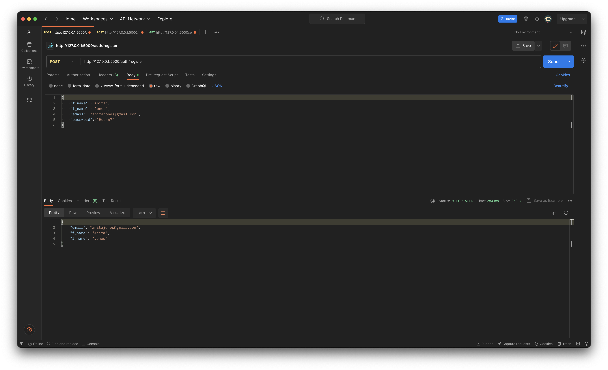

#### `/auth/login`

- HTTP Request Verb: POST
- Description: Allows a new user to login with their registered credentials. The response is a JWT token and user summary, excluding password.
- Required Data: 'email', 'password'
- Authentication Methods: A JWT token is returned to the server for authentication and authorisation purposes.

The following is the expected response from the `auth/login` endpoint using sample data:

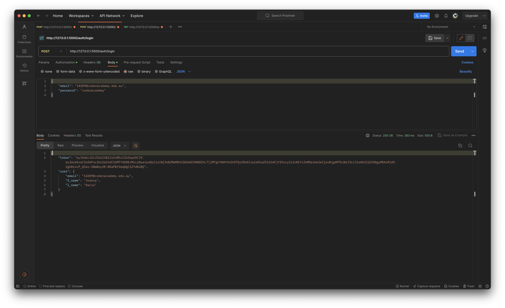

#### `/auth/users`

- HTTP Request Verb: GET
- Description: Allows a user with admin credentials to obtain a JSON list of all registered users. The server response includes nested data regarding areas owned by those users.
- Required Data: 'email', 'password'
- Authentication Methods: `@jwt_required()`, `admin_required()`

The following is the expected response from the `auth/users` endpoint using sample data:

```
[
  {
    "areas": [
      {
        "is_indoor": false,
        "is_outdoor": true,
        "name": "Frontyard"
      },
      {
        "is_indoor": false,
        "is_outdoor": true,
        "name": "Backyard"
      }
    ],
    "email": "14209@coderacademy.edu.au",
    "f_name": "Joshua",
    "l_name": "Davis"
  },
  {
    "areas": [
      {
        "is_indoor": true,
        "is_outdoor": false,
        "name": "House"
      }
    ],
    "email": "neilarmstrong@gmail.com",
    "f_name": "Neil",
    "l_name": "Armstrong"
  },
  {
    "areas": [],
    "email": "donaldtrump@gmail.com",
    "f_name": "Donald",
    "l_name": "Trump"
  }
]
```

#### `/auth/users/<int:user_id>`

- HTTP Request Verb: GET
- Description: Allows a user with admin credentials to obtain a single record for the specified user in the URI using their user ID. The server response includes nested data regarding areas and spaces owned by that user.
- Required Data: 'email', 'password'
- Authentication Methods: `@jwt_required()`, `admin_required()`

The following is the expected response from the `/users/<int:user_id>` endpoint using sample data:

```
{
  "areas": [
    {
      "is_indoor": false,
      "is_outdoor": true,
      "name": "Frontyard"
    },
    {
      "is_indoor": false,
      "is_outdoor": true,
      "name": "Backyard"
    }
  ],
  "email": "14209@coderacademy.edu.au",
  "f_name": "Joshua",
  "l_name": "Davis",
  "spaces": [
    {
      "area": {
        "is_indoor": false,
        "is_outdoor": true,
        "name": "Frontyard"
      },
      "area_id": 1,
      "name": "Rose Garden"
    },
    {
      "area": {
        "is_indoor": true,
        "is_outdoor": false,
        "name": "House"
      },
      "area_id": 3,
      "name": "Kitchen"
    }
  ]
}

```

#### `/auth/users/<int:user_id>`

- HTTP Request Verb: DELETE
- Description: Allows a user with admin credentials to delete a user from the database.
- Required Data: 'email', 'password'
- Authentication Methods: `@jwt_required()`, `admin_required()`

The following is the expected response from the `/users/<int:user_id>` endpoint using sample data: `{}` and error code `200`.

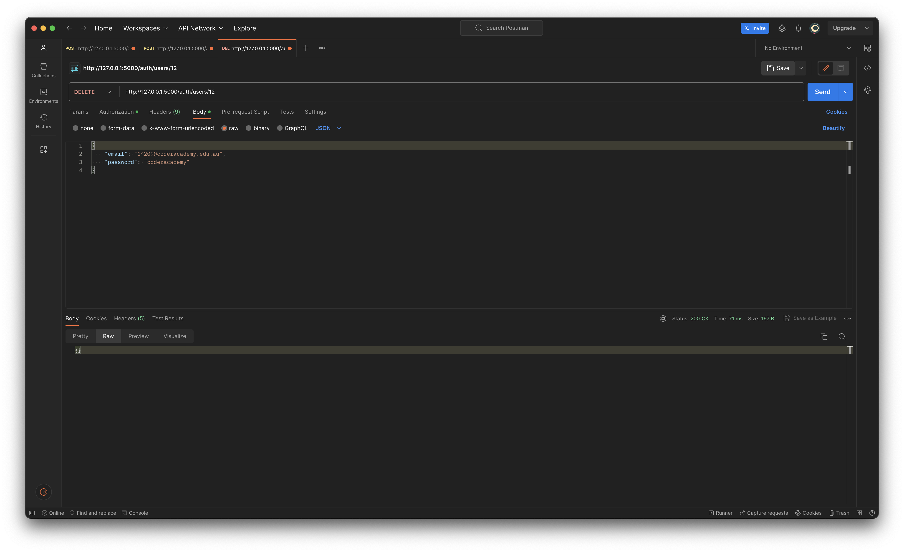

### Area Routes

#### `/areas`

- HTTP Request Verb: GET
- Description: Allows a logged in user to access a list of all areas, nested with associated users and spaces.
- Required Data: None
- Authentication Methods: `@jwt_required()`

The following is the expected response from the `/areas` endpoint using sample data:

```
[
  {
    "id": 2,
    "is_indoor": false,
    "is_outdoor": true,
    "name": "Backyard",
    "spaces": [
      {
        "name": "Vegetable Garden"
      }
    ],
    "user": {
      "email": "14209@coderacademy.edu.au",
      "f_name": "Joshua",
      "l_name": "Davis"
    }
  },
  {
    "id": 1,
    "is_indoor": false,
    "is_outdoor": true,
    "name": "Frontyard",
    "spaces": [
      {
        "name": "Rose Garden"
      },
      {
        "name": "Window Garden"
      }
    ],
    "user": {
      "email": "14209@coderacademy.edu.au",
      "f_name": "Joshua",
      "l_name": "Davis"
    }
  },
  {
    "id": 3,
    "is_indoor": true,
    "is_outdoor": false,
    "name": "House",
    "spaces": [
      {
        "name": "Living Room"
      },
      {
        "name": "Kitchen"
      }
    ],
    "user": {
      "email": "neilarmstrong@gmail.com",
      "f_name": "Neil",
      "l_name": "Armstrong"
    }
  }
]
```

#### `/areas/outdoors`

- HTTP Request Verb: GET
- Description: Allows a logged in user to access a list of all outdoor areas, nested with associated users and spaces.
- Required Data: None
- Authentication Methods: `@jwt_required()`

The following is the expected response from the `/areas/outdoors` endpoint using sample data:

```
[
  {
    "id": 1,
    "is_indoor": false,
    "is_outdoor": true,
    "name": "Frontyard",
    "spaces": [
      {
        "name": "Rose Garden"
      },
      {
        "name": "Window Garden"
      }
    ],
    "user": {
      "email": "14209@coderacademy.edu.au",
      "f_name": "Joshua",
      "l_name": "Davis"
    }
  },
  {
    "id": 2,
    "is_indoor": false,
    "is_outdoor": true,
    "name": "Backyard",
    "spaces": [
      {
        "name": "Vegetable Garden"
      }
    ],
    "user": {
      "email": "14209@coderacademy.edu.au",
      "f_name": "Joshua",
      "l_name": "Davis"
    }
  }
]
```

#### `/areas/<int:area_id>`

- HTTP Request Verb: GET
- Description: Allows a logged in user to access a single area by specifying its ID in the URI.
- Required Data: None
- Authentication Methods: `@jwt_required()`

The following is the expected response from the `/areas/<int:area_id` endpoint using sample data:

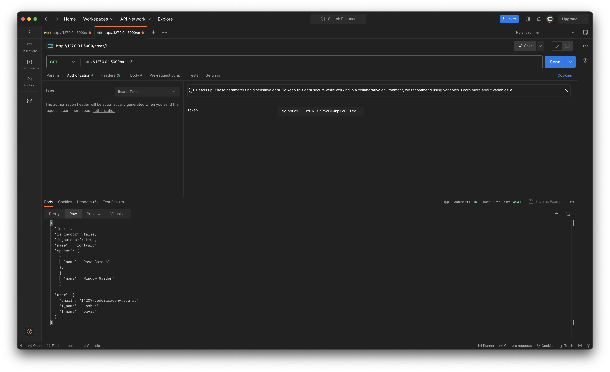

#### `/areas`

- HTTP Request Verb: POST
- Description: Allows a logged in user to create a new area
- Required Data: 'name', 'is_outdoor', 'is_indoor'
- Authentication Methods: `@jwt_required()`

The following is the expected response from the `/areas` endpoint using sample data:

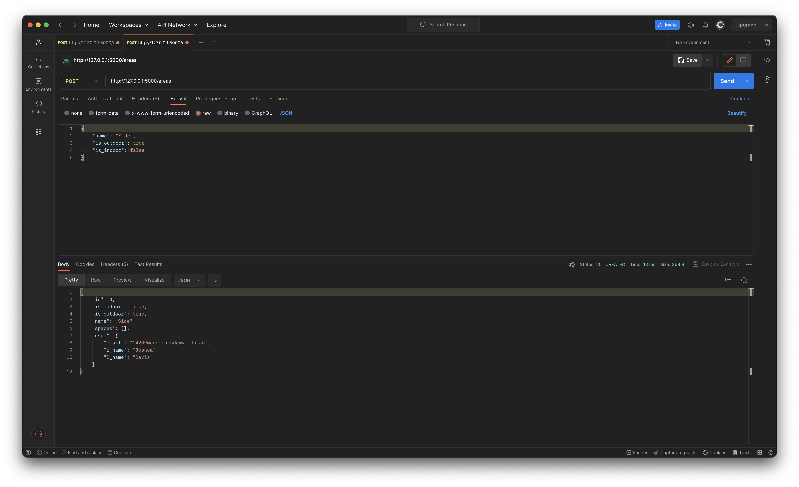

#### `/areas/<int:area_id>`

- HTTP Request Verb: PUT, PATCH
- Description: Allows a logged in user to update an existing area
- Required Data: any to-be-updated fields
- Authentication Methods: `@jwt_required()`, `@admin_or_owner_required()`

The following is the expected response from the `/areas/<int:area_id` endpoint using sample data:

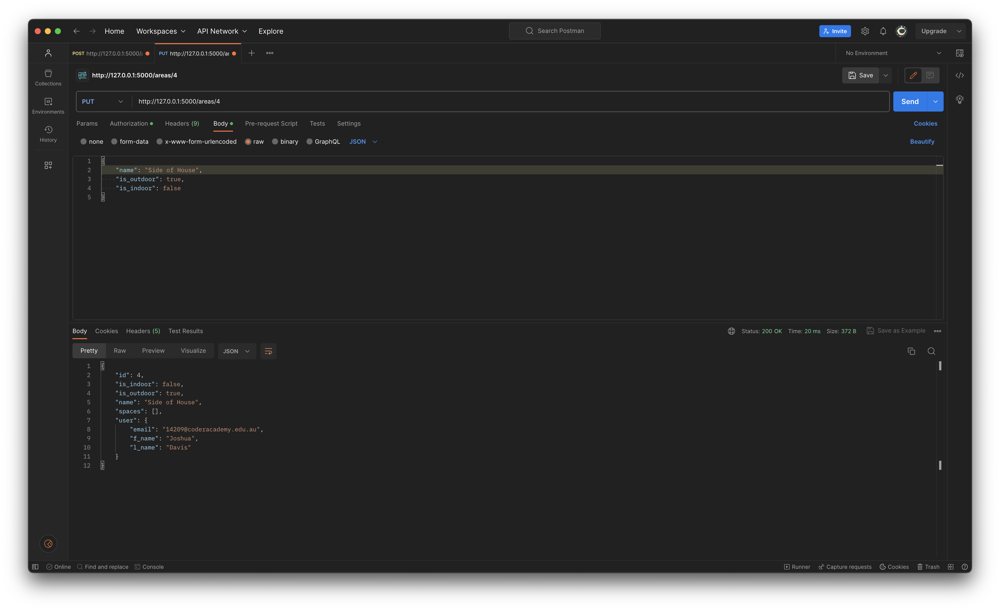

#### `/areas/<int:area_id>`

- HTTP Request Verb: DELETE
- Description: Allows a logged in user to delete an existing area
- Required Data: None
- Authentication Methods: `@jwt_required()`, `@admin_or_owner_required()`

The following is the expected response from the `/areas/<int:area_id` endpoint using sample data:

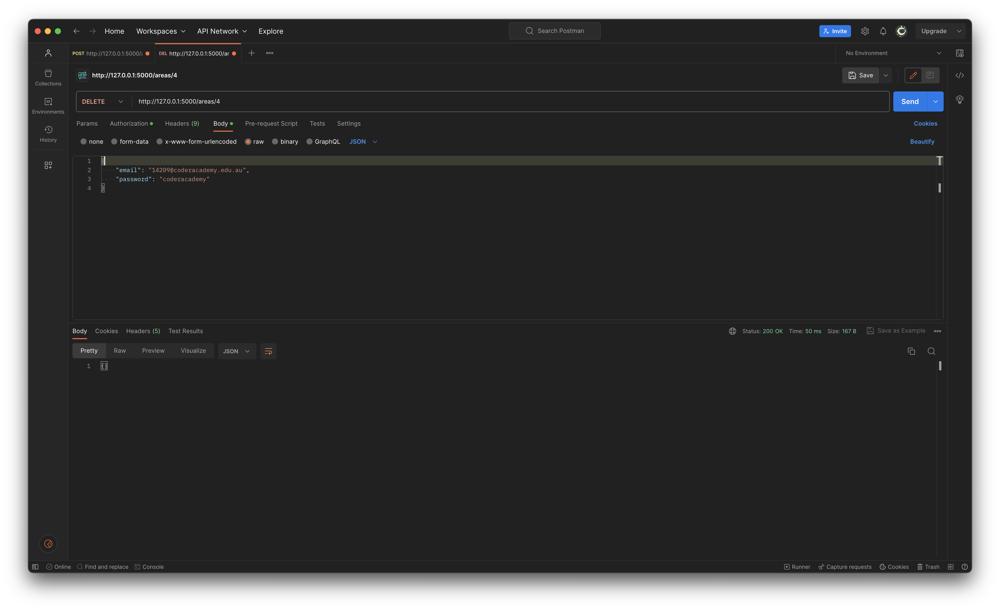

### Space Routes

#### `/spaces`

- HTTP Request Verb: GET
- Description: Allows a logged in user to access a list of all spaces, nested with associated areas.
- Required Data: None
- Authentication Methods: `@jwt_required()`

The following is the expected response from the `/spaces` endpoint using sample data:

```
[
  {
    "area": {
      "is_indoor": true,
      "is_outdoor": false,
      "name": "House"
    },
    "area_id": 3,
    "id": 4,
    "name": "Kitchen",
    "user": {
      "email": "14209@coderacademy.edu.au",
      "f_name": "Joshua",
      "l_name": "Davis"
    }
  },
  {
    "area": {
      "is_indoor": true,
      "is_outdoor": false,
      "name": "House"
    },
    "area_id": 3,
    "id": 3,
    "name": "Living Room",
    "user": {
      "email": "donaldtrump@gmail.com",
      "f_name": "Donald",
      "l_name": "Trump"
    }
  },
  {
    "area": {
      "is_indoor": false,
      "is_outdoor": true,
      "name": "Frontyard"
    },
    "area_id": 1,
    "id": 1,
    "name": "Rose Garden",
    "user": {
      "email": "14209@coderacademy.edu.au",
      "f_name": "Joshua",
      "l_name": "Davis"
    }
  },
  {
    "area": {
      "is_indoor": false,
      "is_outdoor": true,
      "name": "Backyard"
    },
    "area_id": 2,
    "id": 5,
    "name": "Vegetable Garden",
    "user": {
      "email": "neilarmstrong@gmail.com",
      "f_name": "Neil",
      "l_name": "Armstrong"
    }
  },
  {
    "area": {
      "is_indoor": false,
      "is_outdoor": true,
      "name": "Frontyard"
    },
    "area_id": 1,
    "id": 2,
    "name": "Window Garden",
    "user": {
      "email": "neilarmstrong@gmail.com",
      "f_name": "Neil",
      "l_name": "Armstrong"
    }
  }
]
```

#### `/spaces/<int:space_id>`

- HTTP Request Verb: GET
- Description: Allows a logged in user to access a single space by specifying its ID in the URI.
- Required Data: None
- Authentication Methods: `@jwt_required()`

The following is the expected response from the `/spaces/<int:space_id>` endpoint using sample data:

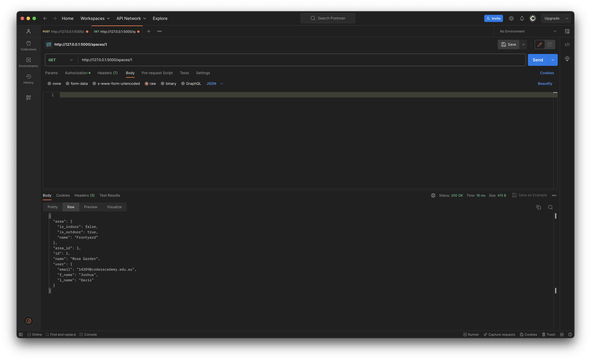

#### `/spaces`

- HTTP Request Verb: POST
- Description: Allows a logged in user to create a new space
- Required Data: 'name', 'area_id'
- Authentication Methods: `@jwt_required()`

The following is the expected response from the `/spaces` endpoint using sample data:

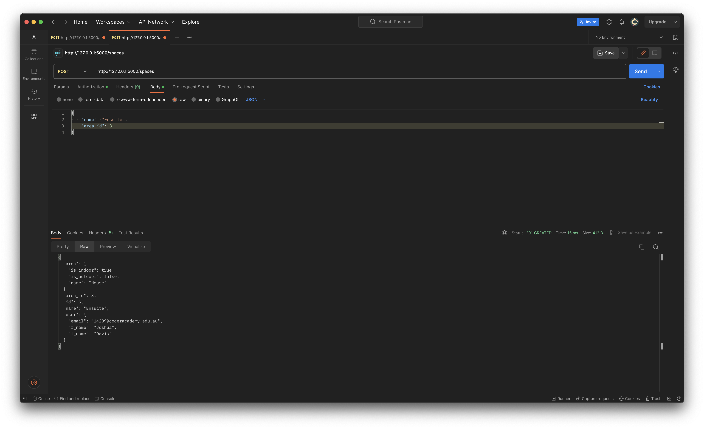

#### `/spaces/<int:space_id>`

- HTTP Request Verb: PUT, PATCH
- Description: Allows a logged in user to update an existing space
- Required Data: any to-be-updated fields
- Authentication Methods: `@jwt_required()`, `admin_or_owner_required()`

The following is the expected response from the `/spaces/<int:space_id>` endpoint using sample data:


#### `/spaces/<int:space_id>`

- HTTP Request Verb: DELETE
- Description: Allows a logged in user to delete an existing space
- Required Data: None
- Authentication Methods: `@jwt_required()`, `admin_or_owner_required()`

The following is the expected response from the `/spaces/<int:space_id>` endpoint using sample data:


### PlantRecord Routes

#### `/plantrecords`

- HTTP Request Verb: GET
- Description: Allows a logged in user to access a list of all plantrecords, nested with associated areas, spaces and plants.
- Required Data: None
- Authentication Methods: `@jwt_required()`, `admin_required`

The following is the expected response from the `/plantrecords` endpoint using sample data:

```
[
  {
    "description": "Camellias are attractive evergreen shrubs with a variety of flower colours.",
    "fertilisation_rate": "Key feeding times are autumn as buds are developing and in spring once flowering has finished.",
    "id": 1,
    "name": "Camellia",
    "other_comments": "Keep the plant moist but well-drained.",
    "plants": [
      {
        "date_fertilised": null,
        "date_planted": null,
        "id": 1,
        "space_id": 1
      }
    ],
    "preferred_location": "Partial sun",
    "user": {
      "areas": [
        {
          "is_indoor": false,
          "is_outdoor": true,
          "name": "Frontyard"
        },
        {
          "is_indoor": false,
          "is_outdoor": true,
          "name": "Backyard"
        }
      ],
      "email": "14209@coderacademy.edu.au",
      "f_name": "Joshua",
      "l_name": "Davis",
      "spaces": [
        {
          "area": {
            "is_indoor": false,
            "is_outdoor": true,
            "name": "Frontyard"
          },
          "area_id": 1,
          "name": "Rose Garden"
        },
        {
          "area": {
            "is_indoor": true,
            "is_outdoor": false,
            "name": "House"
          },
          "area_id": 3,
          "name": "Kitchen"
        }
      ]
    },
    "water_rate": "Average"
  },
  {
    "description": "A large-flowered hybrid plant cultivated as a garden flower.",
    "fertilisation_rate": "Use a controlled release fertiliser when planting.",
    "id": 2,
    "name": "Pansy",
    "other_comments": "Keep the plant moist but well-drained.",
    "plants": [
      {
        "date_fertilised": null,
        "date_planted": null,
        "id": 2,
        "space_id": 1
      }
    ],
    "preferred_location": "Partial sun",
    "user": {
      "areas": [
        {
          "is_indoor": false,
          "is_outdoor": true,
          "name": "Frontyard"
        },
        {
          "is_indoor": false,
          "is_outdoor": true,
          "name": "Backyard"
        }
      ],
      "email": "14209@coderacademy.edu.au",
      "f_name": "Joshua",
      "l_name": "Davis",
      "spaces": [
        {
          "area": {
            "is_indoor": false,
            "is_outdoor": true,
            "name": "Frontyard"
          },
          "area_id": 1,
          "name": "Rose Garden"
        },
        {
          "area": {
            "is_indoor": true,
            "is_outdoor": false,
            "name": "House"
          },
          "area_id": 3,
          "name": "Kitchen"
        }
      ]
    },
    "water_rate": "Average"
  }
]
```

#### `/plantrecords/<int:plantrecord_id>`

- HTTP Request Verb: GET
- Description: Allows a logged in user to access a single plantrecord by specifying its ID in the URI.
- Required Data: None
- Authentication Methods: `@jwt_required()`

The following is the expected response from the `/plantrecords/<int:plantrecord_id>` endpoint using sample data:

```
{
  "description": "Camellias are attractive evergreen shrubs with a variety of flower colours.",
  "fertilisation_rate": "Key feeding times are autumn as buds are developing and in spring once flowering has finished.",
  "id": 1,
  "name": "Camellia",
  "other_comments": "Keep the plant moist but well-drained.",
  "plants": [
    {
      "date_fertilised": null,
      "date_planted": null,
      "id": 1,
      "space_id": 1
    }
  ],
  "preferred_location": "Partial sun",
  "user": {
    "areas": [
      {
        "is_indoor": false,
        "is_outdoor": true,
        "name": "Frontyard"
      },
      {
        "is_indoor": false,
        "is_outdoor": true,
        "name": "Backyard"
      }
    ],
    "email": "14209@coderacademy.edu.au",
    "f_name": "Joshua",
    "l_name": "Davis",
    "spaces": [
      {
        "area": {
          "is_indoor": false,
          "is_outdoor": true,
          "name": "Frontyard"
        },
        "area_id": 1,
        "name": "Rose Garden"
      },
      {
        "area": {
          "is_indoor": true,
          "is_outdoor": false,
          "name": "House"
        },
        "area_id": 3,
        "name": "Kitchen"
      }
    ]
  },
  "water_rate": "Average"
}
```

#### `/plantrecords`

- HTTP Request Verb: POST
- Description: Allows a logged in user to create a new plantrecord
- Required Data: 'name'
- Authentication Methods: `@jwt_required()`

The following is the expected response from the `/plantrecords` endpoint using sample data:

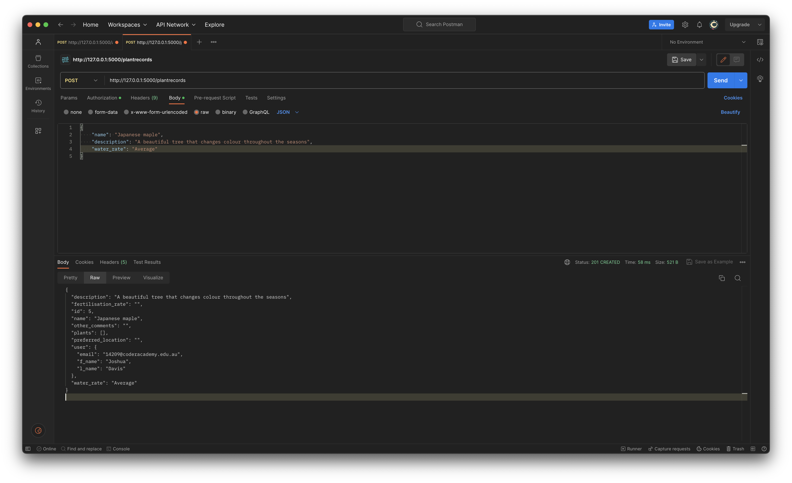

#### `/plantrecords/<int:plantrecord_id>`

- HTTP Request Verb: PUT, PATCH
- Description: Allows a logged in user to update an existing plantrecord
- Required Data: any to-be-updated fields
- Authentication Methods: `@jwt_required()`, `admin_or_owner_required()`

The following is the expected response from the `/plantrecords/<int:plantrecord_id>` endpoint using sample data:

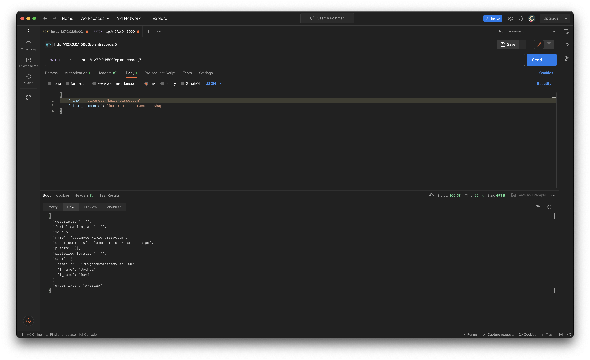

#### `/plantrecords/<int:plantrecord_id>`

- HTTP Request Verb: DELETE
- Description: Allows a logged in user to delete an existing plantrecord
- Required Data: None
- Authentication Methods: `@jwt_required()`, `admin_or_owner_required()`

The following is the expected response from the `/plantrecords/<int:plantrecord_id>` endpoint using sample data:

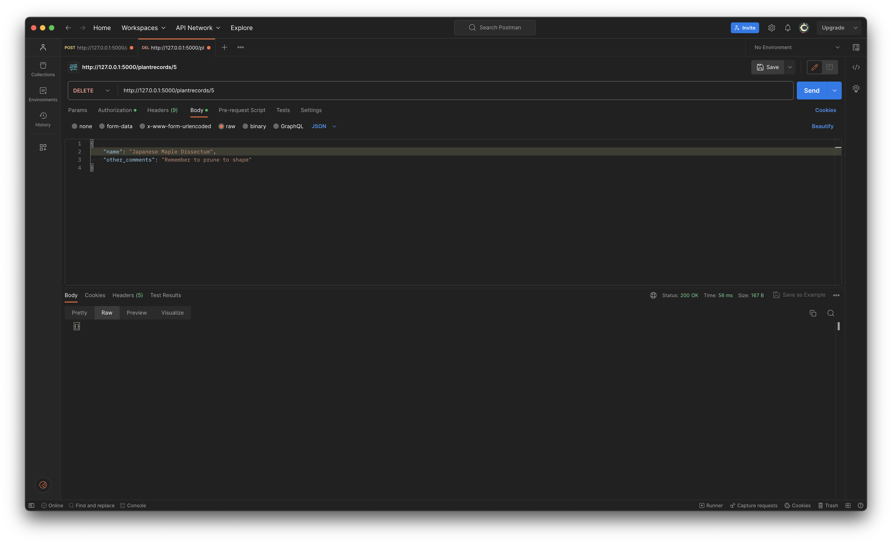

### Plant Routes

#### `/plants`

- HTTP Request Verb: GET
- Description: Allows a logged in user to access a list of all plants with their associated plantrecord
- Required Data: None
- Authentication Methods: `@jwt_required()`, `admin_required`

The following is the expected response from the `/plantrecords` endpoint using sample data:

```
[
  {
    "date_fertilised": null,
    "date_planted": null,
    "id": 1,
    "plantrecord": {
      "fertilisation_rate": "Key feeding times are autumn as buds are developing and in spring once flowering has finished.",
      "name": "Camellia",
      "other_comments": "Keep the plant moist but well-drained.",
      "preferred_location": "Partial sun",
      "water_rate": "Average"
    },
    "plantrecord_id": 1,
    "space_id": 1,
    "user": {
      "email": "14209@coderacademy.edu.au",
      "f_name": "Joshua",
      "l_name": "Davis"
    },
    "user_id": 1
  },
  {
    "date_fertilised": null,
    "date_planted": null,
    "id": 2,
    "plantrecord": {
      "fertilisation_rate": "Use a controlled release fertiliser when planting.",
      "name": "Pansy",
      "other_comments": "Keep the plant moist but well-drained.",
      "preferred_location": "Partial sun",
      "water_rate": "Average"
    },
    "plantrecord_id": 2,
    "space_id": 1,
    "user": {
      "email": "14209@coderacademy.edu.au",
      "f_name": "Joshua",
      "l_name": "Davis"
    },
    "user_id": 1
  }
]

```

#### `/plants/<int:plant_id>`

- HTTP Request Verb: GET
- Description: Allows a logged in user to access a single plant by specifying its ID in the URI.
- Required Data: None
- Authentication Methods: `@jwt_required()`

The following is the expected response from the `/plants/<int:plant_id>` endpoint using sample data:

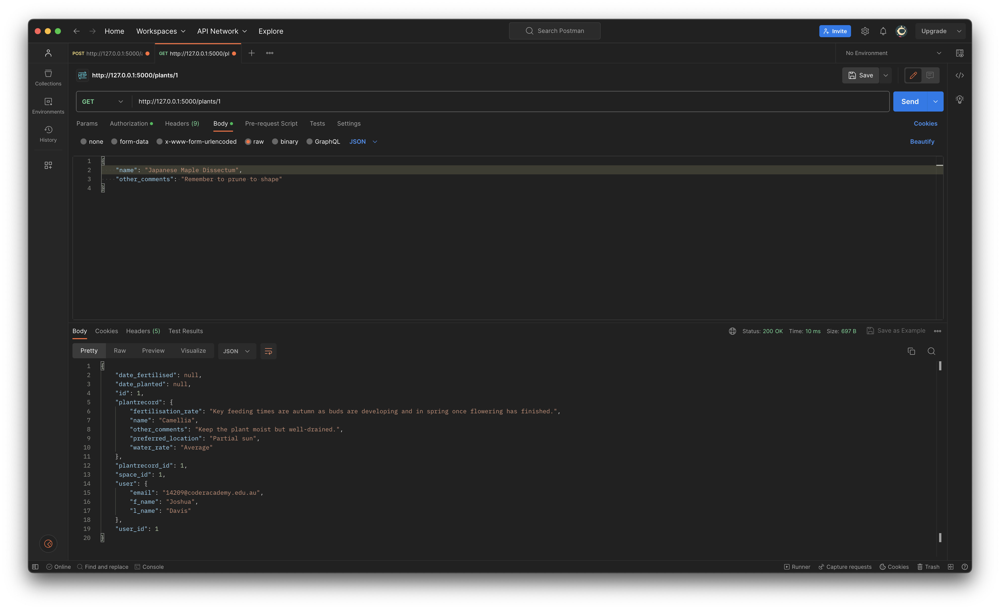

#### `/plants`

- HTTP Request Verb: POST
- Description: Allows a logged in user to create a new plant instance
- Required Data: 'plantrecord_id', 'space_id'
- Authentication Methods: `@jwt_required()`

The following is the expected response from the `/plants` endpoint using sample data:

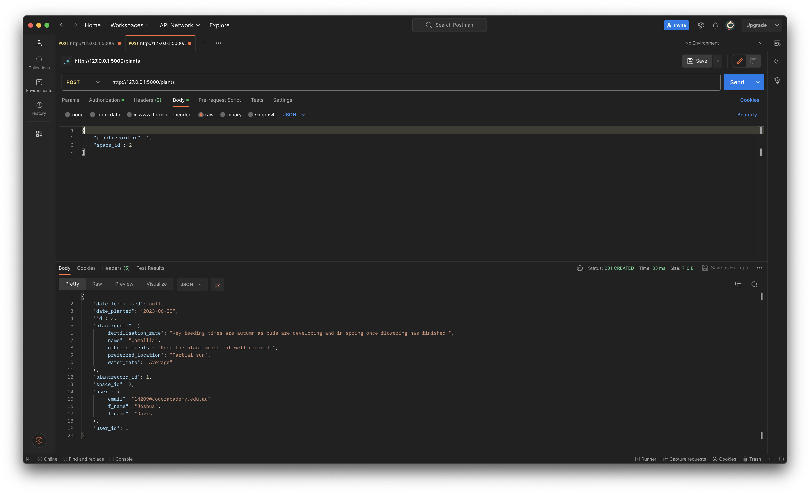

#### `/plants/<int:plant_id>`

- HTTP Request Verb: PUT, PATCH
- Description: Allows a logged in user to update an existing plant
- Required Data: any to-be-updated fields
- Authentication Methods: `@jwt_required()`

The following is the expected response from the `/plants/<int:plant_id>` endpoint using sample data:


#### `/plants/<int:plant_id>`

- HTTP Request Verb: DELETE
- Description: Allows a logged in user to delete an existing plant
- Required Data: None
- Authentication Methods: `@jwt_required()`

The following is the expected response from the `/plants/<int:plant_id>` endpoint using sample data:

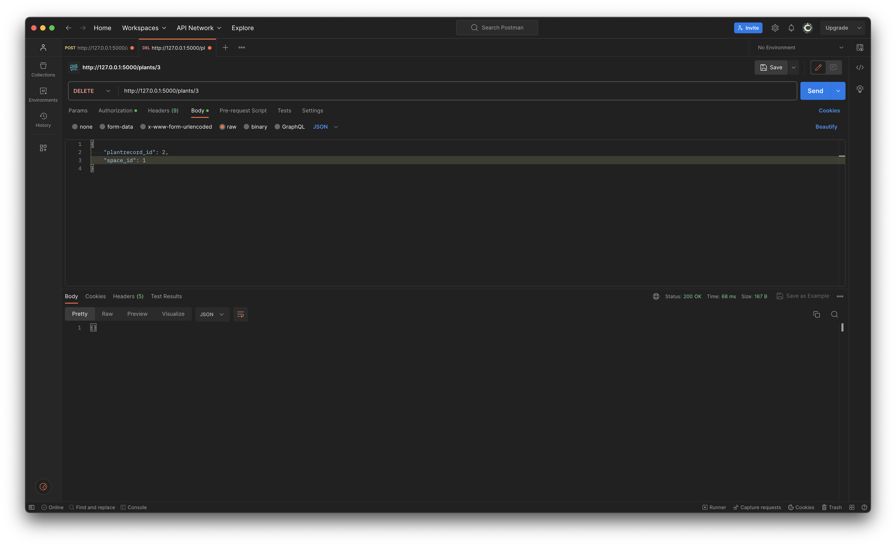

## R6 - Entity Relationship Diagram (ERD)

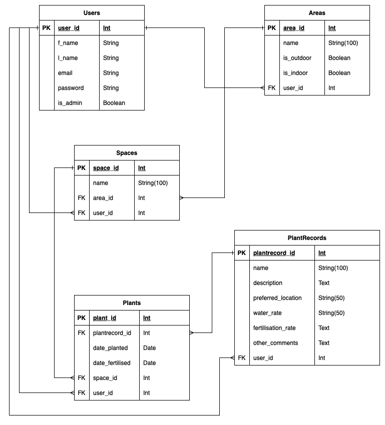  

## R7 - Third Party Services

## R8 - Model Description

## R9 - Database Relations

## R10 - Project Management

## Works Cited

/Advantages of Database Management System (DBMS)/, Java T Point, https://www.javatpoint.com/advantages-of-dbms. Accessed 28 June 2023.

/Benefits of relational databases/, IBM, https://www.ibm.com/topics/relational-databases#:~:text=The%20primary%20benefit%20of%20the,group%2C%20and%20also%20combine%20queries. Accessed 28 June 2023.

/Description of the database normalization basics/, Microsoft, https://learn.microsoft.com/en-us/office/troubleshoot/access/database-normalization-description. Accessed 28 June 2023.

/SQLAlchemy 2.0 Documentation/, SQLAlchemy, https://docs.sqlalchemy.org/en/20/orm/quickstart.html. Accessed 28 June 2023.

/The benefits of PostgreSQL/, Prisma's Data Guide, https://www.prisma.io/dataguide/postgresql/benefits-of-postgresql. Accessed 28 June 2023.

/The Python SQL Toolkit and Object Relational Mapper/, SQLAlchemy, https://www.sqlalchemy.org. Accessed 28 June 2023.

/Understanding Object-Relational Mapping/, altexsoft, https://www.altexsoft.com/blog/object-relational-mapping/. Accessed 28 June 2023.

/What is a database management system?/ IBM, https://www.ibm.com/docs/en/zos-basic-skills?topic=zos-what-is-database-management-system. Accessed 28 June 2023.

/What is PostgreSQL?/ LinkedIn, https://www.linkedin.com/pulse/what-postgresql-introduction-advantages-disadvantages-ankita-sharda. Accessed 28 June 2023.